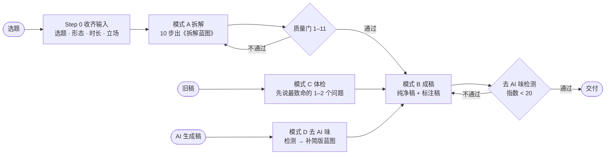
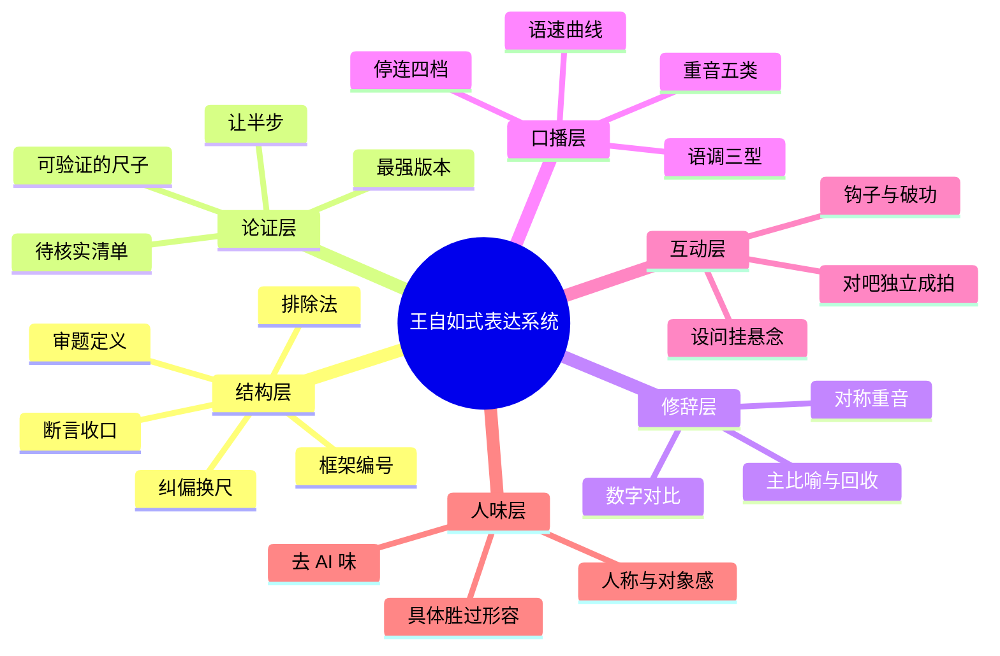

# 王自如式表达拆解 · wangziru-analysis

> 学结构，不学腔调。

  

一个给 AI 编程助手（Claude Code / Codex / Cursor 等）用的 **Agent Skill**：用王自如的表达系统，把一个"大家都在聊、没人讲清楚"的选题，拆成**观众听完能复述的思考框架**，再写成能直接念的口播稿；也能给旧稿做体检，或者把 AI 写的稿子改成人话。

我们把「王自如AI」B 站 **71 个视频**（57 个正式视频 + 14 场直播回放，约 **50 小时**口播、**796,821 字**转写）一篇一篇拆完，连「对吧」这两个字出现了 **1660 次**都数了出来，最后蒸馏成这一个 skill。

> **非官方** · 这是一份表达方法研究，与王自如本人及其团队无关；不使用其声音与肖像，产出的稿子也不应署他的名或冒充本人。



**目录** · [一、使用方式](#一使用方式) · [二、内容质量](#二内容质量) · [三、内容维度](#三内容维度) · [四、去 AI 化](#四去-ai-化) · [案例](#案例) · [目录结构](#目录结构)

---

## 一、使用方式

### 安装

**Claude Code**（个人级，所有项目可用）：

```bash
git clone https://github.com/chrislitality-svg/wangziru-analysis-skill.git ~/.claude/skills/wangziru-analysis
```

Windows PowerShell：

```powershell
git clone https://github.com/chrislitality-svg/wangziru-analysis-skill.git "$env:USERPROFILE\.claude\skills\wangziru-analysis"
```

只想在某个项目里用，就克隆到该项目的 `.claude/skills/wangziru-analysis/`。**其他工具**（Codex、Cursor、ZCode 等）：把仓库放进项目，对它说"先读 `wangziru-analysis/SKILL.md` 再干活"——skill 本身是 Markdown，不依赖运行环境；只有 AI 味检测脚本需要 Python 3.8+（零第三方依赖）。

### 四种模式

| 模式 | 你给它 | 它给你 | 示例 |
|---|---|---|---|
| **A 拆解**（默认） | 一个选题 / 问题 / 产品 / 行业现象 | 《拆解蓝图》：定义、纠偏换尺、排除法、框架、主比喻、收口句、免责、待核实清单 + 质量门自检表 | [示例 01](examples/01-拆解蓝图-AI如何在企业落地.md) |
| **B 成稿** | 已确认的蓝图，或"直接写稿" | **纯净稿**（直接念）+ **标注稿**（停连 / 重音 / 语调）+ 分段时长表 + AI 味指数 | [示例 03](examples/03-成稿-宣传片口播稿.md) |
| **C 体检** | 你写好的旧稿 | 诊断表：先说最致命的 1–2 个问题，再给"原句 → 改写句"对照 | — |
| **D 去 AI 味** | AI 生成的稿子 | 检测报告 + 人话改写稿 + 前后分数对照 | [示例 02](examples/02-去AI味/README.md) |

### 怎么说

| 你想要 | 这样说 |
|---|---|
| 拆一个选题 | "用王自如 skill 拆解一下《XXX》，认知正片，10 分钟" |
| 接着写稿 | "蓝图可以，接着成稿" |
| 短视频 | "按王自如的方式写一条 90 秒竖屏口播，讲 XXX" |
| 体检旧稿 | "帮我体检这篇口播稿：（贴稿子）" |
| 去 AI 味 | "这稿子 AI 味太重，改成人话：（贴稿子）" |

没给立场时，它会替你选一个**有争议的**立场并说明——没有立场就没有纠偏，没有纠偏就不是这套系统。

### 单独用检测器

```bash
python tools/ai_flavor_check.py 稿子.txt          # Markdown 报告
python tools/ai_flavor_check.py 稿子.txt --json   # 给程序用
```

---

## 二、内容质量

质量不靠"感觉还行"。蓝图和成稿共用 **12 道质量门**，每一道都能验：

| # | 质量门 | 怎么验 |
|---|---|---|
| 1 | 开场 12 秒 ≤40 字，3 秒内答得出"这期讲啥" | 数字数；找个路人听开头 |
| 2 | 定义 ≤8 字，外行能一句话转述 | 数字数；让外行复述 |
| 3 | "不是 A 而是 B"的 B **可验证**；A 先让半步 | B 能不能现场打分 / 计算 / 演示 |
| 4 | 排除法 ≥2 个靶子，每个有**具体死因**，不是稻草人 | 每个靶子先写出"它最强的版本" |
| 5 | 主比喻回收 ≥2 次，不混用比喻 | 数回收点 |
| 6 | 框架 2–4 条，命名 ≤6 字，条条平行 | 检查是否一条讲功能、一条讲感受 |
| 7 | 收口句 ≤12 字，含数字或绝对词，降调 | 数字数；能不能截成短视频单独传播 |
| 8 | 无一句超 30 字；黑话每词 ≤2 次且首次带翻译 | 检测器统计长句 |
| 9 | 免责块已按形态 / 商单配装 | 对照 playbook 第 6 章 |
| 10 | 所有数据、案例有出处或标 `[待核实]` | 清单逐条清零 |
| 11 | 升华由论证长出，之后接真实破功点 | 删掉升华段，论证是否还完整 |
| 12 | **去 AI 味**：无套话空词堆砌，「不是A而是B」≤1 次 / 2000 字，无破折号分号 | `tools/ai_flavor_check.py` 指数 < 20 |

**真实自检长这样**（摘自 [示例 01](examples/01-拆解蓝图-AI如何在企业落地.md) 的蓝图末尾）：

| # | 项 | 结果 |
|---|---|---|
| 1 | 开场 ≤40 字、3 秒可答 | ✅ 33 字 |
| 2 | 定义 ≤8 字可转述 | ✅ 6 字 |
| 7 | 收口 ≤12 字 | ✅ 10 字 |
| 10 | 数据有出处或标待核实 | ⚠️ 成稿前清零 |

### 诚信红线

这套表达法有天然的副作用，skill 里写了对冲规则：

| 风险 | 规则 |
|---|---|
| 稻草人 | 每个被排除的方案，先公平陈述它最强的版本，再给死因；写不出最强版本就不许排除 |
| 绝对化 | 重锤词只用在有机制支撑的地方；预测类断言给出"可被打脸的条件" |
| 削足适履 | 每条框架至少配一个真实案例，配不出就砍掉这一条 |
| 编造 | 数据、人名、事件、"我亲测"类经历，一律由你提供或标 `[待核实]` / `[用户补充]` |
| 冒充 | 不照搬原句、不署王自如的名、不写"王自如说" |

---

## 三、内容维度

一篇稿子，skill 从六个层面拆和查：



| 维度 | 看什么 | skill 产出 | 依据（71 篇实测） | 文件 |
|---|---|---|---|---|
| **结构** | 有没有定义、纠偏、排除、框架、收口 | 拆解蓝图 10 节 | 十段脚本骨架 | `blueprint-template.md` |
| **论证** | 尺子可不可验证、靶子是不是稻草人 | 换尺 + 最强版本 + 死因 | 排除法三连的机制拆解 | `playbook` 第 3 章 |
| **修辞** | 一期一个比喻、回收 ≥2 次 | 主比喻（本体 → 极端条件 → 推论） | 比喻是跨内容的 IP 资产 | `strategy` 第四节 |
| **口播** | 停在哪、重读哪、升降调 | 标注稿 `/ // ///` `【】` `↗↘→` | 「所以」前停 0.95s ＞「但是」前 0.7s；重音 70% 给数字和否定词 | `playbook` 第 4 章 |
| **互动** | 确认拍子、设问、钩子 | "对吧"≤15 次且独立成拍 | 「对吧」1660 次，前停 0.9s、后停 1.2s | `quotes-金句库.md` |
| **人味** | 像不像一个人在说话 | AI 味检测报告 + 改写 | 下面第四节 | `de-ai-去AI味.md` |

**形态路由**：认知正片 / 个人叙事 / 教程实操 / 播客对谈 / 直播，各用一套裁剪模板；语速按段落变化——铺垫 240–280 字/分，定义 150–180 字/分，排除法 290+ 字/分，收口 120–150 字/分。

---

## 四、去 AI 化

> **AI 味不是用词问题，是"没有人在说话"的问题。** 删套话只是表层，人味来自三样东西：**立场、具体、对象感**。

### 数据：50 小时口播里，这些词几乎不存在

| AI 稿高频写法 | 71 篇口播实测 | 他实际怎么说 |
|---|---|---|
| 值得注意的是 / 由此可见 / 换言之 | **0 次** | 直接说结论，或"我一定要强调" |
| 至关重要 / 有效地 | **0 次** | "非常重要 / 最核心"，或直接给后果 |
| 在当今……时代 / 总的来说 / 希望对你有所帮助 | **0 次** | 开场用钩子，结尾用收口句 |
| 综上所述 | 1 次 | "一句话总结" |
| 首先……**其次**……最后 | 首先 159 次，**其次只有 7 次** | "第一 / 第二 / 第三"（847 / 620 / 206 次） |
| 一方面……**另一方面** | 一方面 37 次，**另一方面只有 2 次** | 只讲有用的那一面 |
| 不是 A，而是 B | **0.6 次 / 万字** | 一期只用一次，用在纠偏主句上 |

反过来，这些是口播里的高频人味信号（次 / 万字）：

```
你        ████████████████████████████████  153.8
我们      ██████████                         49.1
吗 + 呢   █████████                          41.9
其实      ███████                            31.6
我觉得    █████                              22.9
对吧      ████                               20.8
那么      ███                                15.7
```

### 前后对照：同一个题材，AI 稿 vs skill 改写

<table>
<tr><th width="50%">典型 AI 稿（AI 味指数 77）</th><th width="50%">skill 改写（AI 味指数 0）</th></tr>
<tr valign="top"><td>

在当今数字化转型的时代浪潮下，人工智能正以前所未有的速度重塑各行各业。那么，企业究竟该如何让AI真正落地呢？

首先，企业需要明确战略方向。AI落地不是一蹴而就的技术采购，而是一项系统性工程。……

其次，数据是AI的基础。值得注意的是，许多企业的数据分散在不同系统中，形成了数据孤岛。……

总的来说，AI落地是一场马拉松，而不是短跑——它不是技术问题，而是管理问题。……希望本文对你有所帮助！

</td><td>

如果你是老板，你现在最常问的一句话，大概是：哪家的模型最聪明？

这个问题有道理，选错模型确实会翻车。但它非常片面。

你想想，一个顶尖的实习生第一天来上班。没账号，没资料，也没人告诉他做完交给谁。他再聪明，能干出活吗？

所以 AI 落地，我给它的定义就六个字：给 AI 办入职。……

三样没给，再聪明也白搭。

</td></tr>
</table>

| 指标 | AI 稿 | 改写 | 口播基准 |
|---|---|---|---|
| AI 味指数 | **77** | **0** | 原片中位 8 |
| 套话 / 空词命中 | 19 处 | 0 | — |
| 「不是A，而是B」 | 3 次 | 0 | 0.6 次 / 万字 |
| 句长中位 | 24 字 | 15 字 | 18 字 |
| 人称密度（每千字） | 2.9 | 15.8 | 40.6 |
| 数字密度（每千字） | 0 | 22.1 | 18.1 |

完整过程（体检 → 补蓝图 → 改写 → 逐句对照）见 [示例 02](examples/02-去AI味/README.md)。

### 十类 AI 味特征

| # | 特征 | 一眼识别 | 改法 |
|---|---|---|---|
| 1 | 书面连接套话 | 首先 / 其次 / 此外 / 值得注意的是 | 编号用"第一 / 第二"，条理靠停顿 |
| 2 | 对称凑数 | 一方面…另一方面、不仅…更… | 只留有话说的那一面 |
| 3 | 「不是A而是B」滥用 | 一篇里 2 次以上 | 全稿留 1 次，A 先让半步 |
| 4 | 宏大空词 | 赋能 / 深度融合 / 时代浪潮 | 换成动作或数字 |
| 5 | 修饰堆叠 | 至关重要 / 不可或缺 / 显著 | 删形容词，用后果说话 |
| 6 | 上帝视角 | 通篇"企业应当" | 主语换成"你"，判断前加"我觉得" |
| 7 | 无立场收尾 | 各有利弊 / 因人而异 | 给判断 + 可被打脸的条件 |
| 8 | 书面标点与长句 | 破折号、分号、一逗到底 | 拆成短句瀑布 |
| 9 | AI 腔开头结尾 | 在当今 / 希望对你有所帮助 | 钩子开场，收口句结尾 |
| 10 | 没有具体 | 0 数字 0 案例 | 每个论点配一个数字或场景，没有就标 `[用户补充]` |

**检测器是透明的**：零依赖、公式全写在代码和 [`de-ai-去AI味.md`](references/de-ai-去AI味.md) 里。用 71 篇原片转写校准过——**真人口播中位 8 分，93% 低于 20 分**。

**也别矫枉过正**：往稿子里硬塞"对吧""其实"不是人味，是腔调——那正是这个 skill 反对的东西。

---

## 案例

| 示例 | 模式 | 看点 |
|---|---|---|
| [01 拆解蓝图：AI 如何在企业落地](examples/01-拆解蓝图-AI如何在企业落地.md) | A | 6 字定义"给 AI 办入职"、三个非稻草人靶子、待核实清单、质量门自检 |
| [02 去 AI 味：一篇典型 AI 稿的体检与改写](examples/02-去AI味/README.md) | D | 77 → 0，先修结构再换词，五处原句对照，可复跑的检测报告 |
| [03 成稿：宣传片《我们蒸馏了王自如》口播稿](examples/03-成稿-宣传片口播稿.md) | B | 28 句对应骨架、纯净稿 + 全标注稿、「不是A而是B」全片只用 1 次 |

## 目录结构

```
SKILL.md                              入口：四种模式、工作流程、12 道质量门、红线
references/
  blueprint-template.md               拆解蓝图格式、开场钩子库、形态路由、完整示例（每次拆解必读）
  playbook-句法手册.md                 十段脚本骨架、七武器句法、停连重音标注、词汇替换表、积木块、训练计划
  de-ai-去AI味.md                      十类 AI 味特征、71 篇口播实测基准、改写顺序、检测公式
  quotes-金句库.md                     各类句子的节奏范例（含重音 / 停连标注）
  samples-标杆拆解.md                  两篇标杆视频的分钟级结构拆解
  strategy-内容战略与局限.md            选题策划、系列化，以及这套方法"解释不了什么"
tools/
  ai_flavor_check.py                  AI 味检测器（零依赖，Python 3.8+）
examples/                             三个完整案例（拆解 / 去 AI 味 / 成稿）
```

## 关于引用

`references/` 中的少量原话引用（主要在 `quotes-金句库.md`，标注了出处视频与时间点）来自王自如公开视频的机器转写，**版权归原作者所有**，仅用于表达方法的分析与评论。文中的词频统计由逐篇转写只读计算得出。原始全文转写语料不随本仓库发布。如原作者认为不妥，请提 Issue，我会第一时间删改。

## 协议

[CC BY-NC 4.0](LICENSE)：可自由使用、修改、转发，须署名，禁止商用。上面「关于引用」中的原话引用不在本协议授权范围内。
