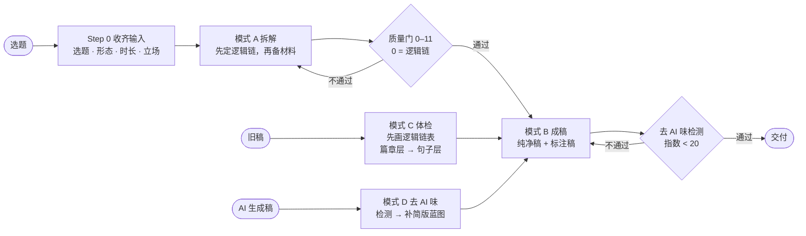
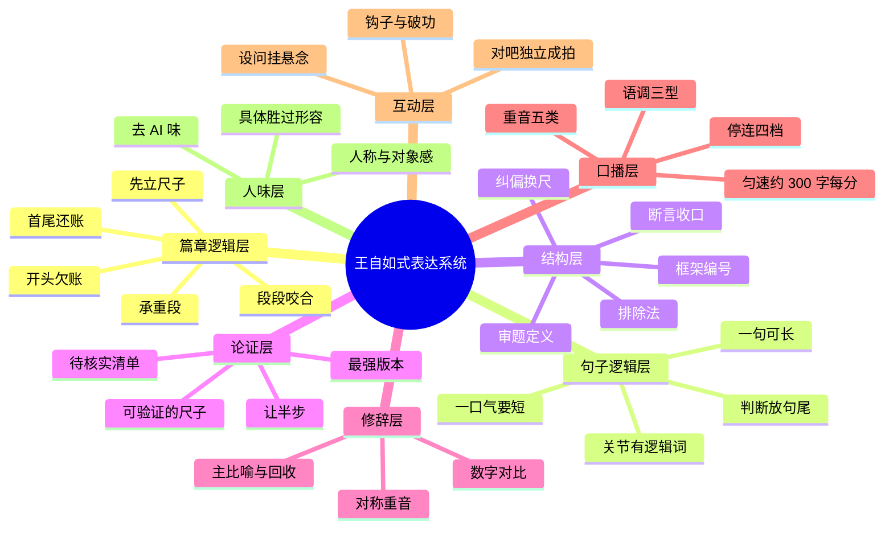

# 王自如式表达拆解 · wangziru-analysis

> 学结构，不学腔调。

  

一个给 AI 编程助手（Claude Code / Codex / Cursor 等）用的 **Agent Skill**：用王自如的表达系统，把一个"大家都在聊、没人讲清楚"的选题，拆成**观众听完能复述的思考框架**，再写成能直接念的口播稿；也能给旧稿做体检，或者把 AI 写的稿子改成人话。

**v1.3 起，skill 先查逻辑，再查句子。** 篇章层看先讲什么、理由是什么、段与段怎么递进、案例放在哪、结尾怎么回到开头；句子层看长句怎么把推理说出来。他的话听着像英文，是因为每个逻辑关系都用一个词说了出来。详见[二、表达逻辑](#二表达逻辑)。

我们把「王自如AI」B 站 **71 个视频**（57 个正式视频 + 14 场直播回放，约 **50 小时**口播、**796,821 字**转写）一篇一篇拆完，连「对吧」这两个字出现了 **1660 次**都数了出来，最后蒸馏成这一个 skill。

> **非官方** · 这是一份表达方法研究，与王自如本人及其团队无关；不使用其声音与肖像，产出的稿子也不应署他的名或冒充本人。



**目录** · [一、使用方式](#一使用方式) · [二、表达逻辑](#二表达逻辑) · [三、内容质量](#三内容质量) · [四、内容维度](#四内容维度) · [五、去 AI 化](#五去-ai-化) · [六、数据复盘](#六数据复盘) · [案例](#案例) · [目录结构](#目录结构) · [更新记录](CHANGELOG.md)

---

## 一、使用方式

### 安装

**Claude Code**（个人级，所有项目可用）：

```bash
git clone https://github.com/chrislitality-svg/wangziru-analysis-skill.git ~/.claude/skills/wangziru-analysis
```

Windows PowerShell：

```powershell
git clone https://github.com/chrislitality-svg/wangziru-analysis-skill.git "$env:USERPROFILE\.claude\skills\wangziru-analysis"
```

只想在某个项目里用，就克隆到该项目的 `.claude/skills/wangziru-analysis/`。**其他工具**（Codex、Cursor、ZCode 等）：把仓库放进项目，对它说"先读 `wangziru-analysis/SKILL.md` 再干活"——skill 本身是 Markdown，不依赖运行环境；只有 AI 味检测脚本需要 Python 3.8+（零第三方依赖）。

### 四种模式

| 模式 | 你给它 | 它给你 | 示例 |
|---|---|---|---|
| **A 拆解**（默认） | 一个选题 / 问题 / 产品 / 行业现象 | 《拆解蓝图》：定义、纠偏换尺、排除法、框架、主比喻、收口句、免责、待核实清单 + 质量门自检表 | [示例 01](examples/01-拆解蓝图-AI如何在企业落地.md) |
| **B 成稿** | 已确认的蓝图，或"直接写稿" | **纯净稿**（直接念）+ **标注稿**（停连 / 重音 / 语调）+ 分段时长表 + AI 味指数 | [示例 03](examples/03-成稿-宣传片口播稿.md) |
| **C 体检** | 你写好的旧稿 | 先画逻辑链表、过逻辑五问，再说最致命的 1–2 个问题，给"原顺序 → 新顺序""原句 → 改写句"对照 | [示例 04](examples/04-成稿-给方法做体检.md) |
| **D 去 AI 味** | AI 生成的稿子 | 检测报告 + 人话改写稿 + 前后分数对照 | [示例 02](examples/02-去AI味/README.md) |

### 怎么说

| 你想要 | 这样说 |
|---|---|
| 拆一个选题 | "用王自如 skill 拆解一下《XXX》，认知正片，10 分钟" |
| 接着写稿 | "蓝图可以，接着成稿" |
| 短视频 | "按王自如的方式写一条 90 秒竖屏口播，讲 XXX" |
| 体检旧稿 | "帮我体检这篇口播稿：（贴稿子）" |
| 去 AI 味 | "这稿子 AI 味太重，改成人话：（贴稿子）" |

没给立场时，它会替你选一个**有争议的**立场并说明——没有立场就没有纠偏，没有纠偏就不是这套系统。

### 效果取决于你用的模型

skill 是一份说明书，真正执行它的是你接的模型。同一份 skill，换成 GPT、Claude、Grok 或它们的不同型号，拆解的深度、逻辑链表排得对不对、会不会为了"具体"去编数字，差别都可能很大。

- 本仓库的 skill、示例和 v1.3 的逻辑链、长句分析，都是在 Claude Code 里用 **Claude Opus 5.5** 做的。其他模型我们没有系统测过，不做评价。
- 尽量在能读文件、能跑 Python 的工具里用（Claude Code / Codex / Cursor 等）：skill 要按需读十几份参考文件，还要跑检测脚本。只能对话的环境也能用，但要手动贴参考文件，检测只能人工扫。
- 换了模型，先拿 [示例 01](examples/01-拆解蓝图-AI如何在企业落地.md) 的同一个选题跑一遍对比，再用[逻辑体检](#逻辑体检)和 `tools/ai_flavor_check.py` 给输出做一次体检。欢迎在 Issues 里告诉我们你的模型和结果。

### 单独用检测器

```bash
python tools/ai_flavor_check.py 稿子.txt          # Markdown 报告
python tools/ai_flavor_check.py 稿子.txt --json   # 给程序用
```

---

## 二、表达逻辑

> 句式像不像他是表面，**论证顺序**才是这套方法值钱的地方。我们曾经写出一版句子指标全部达标的稿子（AI 味 8 分、确定词 0 次），被评价「太空了，都是空话」，问题全在逻辑上。所以 v1.3 起，拆解、成稿、体检都先查逻辑，分两层查。

### 篇章层：先讲什么，为什么，怎么递进，怎么收回开头

从《对轻薄手机认知》《我又要创业了！》《过去的 48 天》《解构"龙虾"》四条代表作的完整转写里，逐段拆出逻辑链，归纳成四条公理：

| 公理 | 他怎么做 | 例 |
|---|---|---|
| **开头先欠观众一笔账** | 一个场景、一个反差、一串质疑，结尾必须还 | 《过去的 48 天》开头是开会时谁也说不清日程，结尾重演一场会，一张图建好 9 个日程 |
| **先立尺子，再下判断** | 任何"好 / 坏"出现之前，标准先立好 | 《对轻薄》先论证看容量、不看厚度，四款手机才有统一的量法 |
| **每段回答上一段留下的问题** | 段与段是问答咬合，不是并列 | 《解构龙虾》：为什么火 → 门槛降了 → 新在哪 → 本地化加记忆 → 为什么手机上被封、PC 上被捧 → 权限哲学 |
| **有一段删掉就会塌** | 承重段，后面每个判断都从它来 | 《解构龙虾》的 PC 管理员权限 vs 手机沙箱 |

| 推进骨架 | 顺序 | 适合 |
|---|---|---|
| 先定尺，再测量 | 定性 → 换尺 → 讲清尺子怎么量 → 选基准深拆 → 其余按"对基准的回应"测 → 上升到行业 | 纠偏评测、多对象对比 |
| 结论先行的倒叙决策链 | 报终点、摆质疑 → 回到起点 → 立标准 → 机会出现、逐项打勾 → 兑现代价 → 本人出场结账 | 个人叙事 |
| 成品先行，按决策组织 | 痛点场景 → 成品演示 → 用难度标准排除替代方案 → 讲关键决策 → 代价 → 重演开头场景 | 复盘、作品展示 |
| 反差立题，层层下挖 | 祛魅 → 抛反差 → 逐层追问原因 → 预测 → 给预测打折 → 分档建议 → 升成方法 | 热点解读 |

**案例放哪**：证明用的案例放在论点**后面**；放在论点前面的只有痛点场景、对照组、成品演示，它们的任务是把问题立起来。**首尾呼应**四种：场景重演、账单结清、方法升格、比喻回收；不是每条都会自然闭环，所以写稿时当成必查项。

### 句子层：他像英文，是因为把逻辑说出来了

v1.2 以前我们写的是「句长中位 18 字，极少超过 30 字，长信息拆成短句瀑布」。**这个数量的是呼吸，不是句子**：机器转写按停顿切行，我们把每一口气当成了一句话。按语法重新断句（四条代表作、234 句）：

| | 一句话（语法句） | 一口气（逗号之间） |
|---|---|---|
| 中位 | **28.5 字**（论证句 27–36） | **10 字** |
| P90 | 59 字 | 20 字 |
| 超过 30 字 | **45%** | 超过 25 字的只有 3% |

一句话平均分 3.7 口气说完。长度不是靠长定语（十类结构里最少的一类），而是**分句一节一节往右接，每个关节放一个词**：因为、所以、如果…那、只有…才、也就是说、它、这。全库 71 篇里，这组逻辑词在他的长视频是 **24.9 次 / 千字**；我们按短句规则写的稿子只有 12 次左右，差不多是一半。

| 我们按旧规则写的 | 按长句逻辑改的 | 拆短丢了什么 |
|---|---|---|
| 大多数人看博主，看的是播放量。这有道理，播放最直观。但它非常片面。 | 大多数人看博主看的是播放量，这有它的道理，因为播放最直观，但只看播放的话，是非常片面的。 | 「因为」标出让步的理由；「只看…的话」把片面限定在条件上。短句版说成了播放本身片面 |

写法规则：**一句话可以长，一口气要短**（10 字左右、最长不超过 20 字）；关节处必须有逻辑词；框架和条件放句首，判断放句尾；长句推理，短句落槌。他的长句和 AI 翻译腔不是一回事：翻译腔是定语长、空动词（进行 / 基于 / 实现）、名词堆砌，这些在他的转写里几乎是 0。

### 逻辑体检

1. 开头欠了观众什么账？结尾还了吗？
2. 第一个判断出现之前，尺子立了吗？
3. 每一段能不能说出"它回答了上一段的什么"？
4. 证明用的案例，是不是紧跟在论点后面？
5. 承重段是哪一段？删掉它会不会塌？
6. 句子层：段内句子之间的因果、条件、让步，有没有用词说出来？

完整方法：[`references/logic-表达逻辑.md`](references/logic-表达逻辑.md)（篇章层）· [`references/syntax-长句逻辑.md`](references/syntax-长句逻辑.md)（句子层）· 示范：[示例 04](examples/04-成稿-给方法做体检.md)，同一个题目三版稿子，为什么第一版是空话、第二版为什么不像他。

---

## 三、内容质量

质量不靠"感觉还行"。蓝图和成稿共用 **13 道质量门**（0–12），每一道都能验。第 0 道最先查，不过就不看后面：

| # | 质量门 | 怎么验 |
|---|---|---|
| **0** | **逻辑链**：开头欠的账结尾还了；判断之前尺子已立；每段能说出回答了上一段的什么；证明用的案例紧跟论点；能指出承重段 | 画逻辑链表，逐段填"为什么放这里" |
| 1 | 开场 12 秒 ≤40 字，3 秒内答得出"这期讲啥" | 数字数；找个路人听开头 |
| 2 | 定义 ≤8 字，外行能一句话转述 | 数字数；让外行复述 |
| 3 | "不是 A 而是 B"的 B **可验证**；A 先让半步 | B 能不能现场打分 / 计算 / 演示 |
| 4 | 排除法 ≥2 个靶子，每个有**具体死因**，不是稻草人 | 每个靶子先写出"它最强的版本" |
| 5 | 主比喻回收 ≥2 次，不混用比喻 | 数回收点 |
| 6 | 框架 2–4 条，命名 ≤6 字，条条平行 | 检查是否一条讲功能、一条讲感受 |
| 7 | 收口句 ≤12 字，含数字或绝对词，降调 | 数字数；能不能截成短视频单独传播 |
| 8 | 一口气（逗号之间）≤20 字，关节处有逻辑词；黑话每词 ≤2 次且首次带翻译 | 检测器统计分句长度和逻辑词密度 |
| 9 | 免责块已按形态 / 商单配装 | 对照 playbook 第 6 章 |
| 10 | 所有数据、案例有出处或标 `[待核实]` | 清单逐条清零 |
| 11 | 升华由论证长出，之后接真实破功点 | 删掉升华段，论证是否还完整 |
| 12 | **去 AI 味**：无套话空词堆砌，「不是A而是B」≤1 次 / 2000 字，确定词 ≤2 次 / 千字，无破折号分号 | `tools/ai_flavor_check.py` 指数 < 20 |

**真实自检长这样**（摘自 [示例 01](examples/01-拆解蓝图-AI如何在企业落地.md) 的蓝图末尾）：

| # | 项 | 结果 |
|---|---|---|
| 1 | 开场 ≤40 字、3 秒可答 | ✅ 33 字 |
| 2 | 定义 ≤8 字可转述 | ✅ 6 字 |
| 7 | 收口 ≤12 字 | ✅ 10 字 |
| 10 | 数据有出处或标待核实 | ⚠️ 成稿前清零 |

### 诚信红线

这套表达法有天然的副作用，skill 里写了对冲规则：

| 风险 | 规则 |
|---|---|
| 稻草人 | 每个被排除的方案，先公平陈述它最强的版本，再给死因；写不出最强版本就不许排除 |
| 绝对化 | 确定词 ≤ 2 次 / 千字；重锤词只用在有机制支撑的地方；预测类断言给出"可被打脸的条件" |
| 削足适履 | 每条框架至少配一个真实案例，配不出就砍掉这一条 |
| 编造 | 数据、人名、事件、"我亲测"类经历，一律由你提供或标 `[待核实]` / `[用户补充]` |
| 冒充 | 不照搬原句、不署王自如的名、不写"王自如说" |

---

## 四、内容维度

一篇稿子，skill 从八个层面拆和查，前两层最先查：



| 维度 | 看什么 | skill 产出 | 依据（71 篇实测） | 文件 |
|---|---|---|---|---|
| **篇章逻辑** | 先讲什么、为什么、怎么递进、案例放哪、怎么收回开头 | 蓝图第 0 节逻辑链表 | 四条代表作逐段逻辑链 | `logic-表达逻辑.md` |
| **句子逻辑** | 一句话里、句与句之间的推理有没有说出来 | 长句写法 + 九种骨架 | 234 句按语法重新断句；逻辑词 24.9 次 / 千字 | `syntax-长句逻辑.md` |
| **结构** | 有没有定义、纠偏、排除、框架、收口 | 拆解蓝图 1–8 节 | 十段脚本骨架 | `blueprint-template.md` |
| **论证** | 尺子可不可验证、靶子是不是稻草人 | 换尺 + 最强版本 + 死因 | 排除法三连的机制拆解 | `playbook` 第 3 章 |
| **修辞** | 一期一个比喻、回收 ≥2 次 | 主比喻（本体 → 极端条件 → 推论） | 比喻是跨内容的 IP 资产 | `strategy` 第四节 |
| **口播** | 停在哪、重读哪、升降调 | 标注稿 `/ // ///` `【】` `↗↘→` | 「所以」前停 0.95s ＞「但是」前 0.7s；重音 70% 给数字和否定词 | `playbook` 第 4 章 |
| **互动** | 确认拍子、设问、钩子 | "对吧"≤15 次且独立成拍 | 「对吧」1660 次，前停 0.9s、后停 1.2s | `quotes-金句库.md` |
| **人味** | 像不像一个人在说话 | AI 味检测报告 + 改写 | 下面第四节 | `de-ai-去AI味.md` |

**形态路由**：认知正片 / 个人叙事 / 教程实操 / 播客对谈 / 直播，各用一套裁剪模板。语速按成片约 300 字/分匀速估算（实测全程 303–321 字/分），轻重缓急靠停顿和剪辑。

---

## 五、去 AI 化

> **AI 味不是用词问题，是"没有人在说话"的问题。** 删套话只是表层，人味来自三样东西：**立场、具体、对象感**。

### 数据：50 小时口播里，这些词几乎不存在

| AI 稿高频写法 | 71 篇口播实测 | 他实际怎么说 |
|---|---|---|
| 值得注意的是 / 由此可见 / 换言之 | **0 次** | 直接说结论，或"我一定要强调" |
| 至关重要 / 有效地 | **0 次** | "非常重要 / 最核心"，或直接给后果 |
| 在当今……时代 / 总的来说 / 希望对你有所帮助 | **0 次** | 开场用钩子，结尾用收口句 |
| 综上所述 | 1 次 | "一句话总结" |
| 首先……**其次**……最后 | 首先 159 次，**其次只有 7 次** | "第一 / 第二 / 第三"（847 / 620 / 206 次） |
| 一方面……**另一方面** | 一方面 37 次，**另一方面只有 2 次** | 只讲有用的那一面 |
| 不是 A，而是 B | **0.6 次 / 万字** | 一期只用一次，用在纠偏主句上 |

反过来，这些是口播里的高频人味信号（次 / 万字）：

```
你        ████████████████████████████████  153.8
我们      ██████████                         49.1
吗 + 呢   █████████                          41.9
其实      ███████                            31.6
我觉得    █████                              22.9
对吧      ████                               20.8
那么      ███                                15.7
```

### 前后对照：同一个题材，AI 稿 vs skill 改写

<table>
<tr><th width="50%">典型 AI 稿（AI 味指数 73）</th><th width="50%">skill 改写（AI 味指数 0）</th></tr>
<tr valign="top"><td>

在当今数字化转型的时代浪潮下，人工智能正以前所未有的速度重塑各行各业。那么，企业究竟该如何让AI真正落地呢？

首先，企业需要明确战略方向。AI落地不是一蹴而就的技术采购，而是一项系统性工程。……

其次，数据是AI的基础。值得注意的是，许多企业的数据分散在不同系统中，形成了数据孤岛。……

总的来说，AI落地是一场马拉松，而不是短跑——它不是技术问题，而是管理问题。……希望本文对你有所帮助！

</td><td>

如果你是老板，你现在最常问的一句话，大概是：哪家的模型最聪明？

这个问题有道理，选错模型确实会翻车。但它非常片面。

你想想，一个顶尖的实习生第一天来上班。没账号，没资料，也没人告诉他做完交给谁。他再聪明，能干出活吗？

所以 AI 落地，我给它的定义就六个字：给 AI 办入职。……

三样没给，再聪明也白搭。

</td></tr>
</table>

| 指标 | AI 稿 | 改写 | 口播基准 |
|---|---|---|---|
| AI 味指数 | **73** | **0** | 原片中位 10 |
| 套话 / 空词命中 | 19 处 | 0 | — |
| 「不是A，而是B」 | 3 次 | 0 | 0.6 次 / 万字 |
| 逻辑词（每千字） | 11.6 | 31.5 | 长视频 24.9 |
| 人称密度（每千字） | 2.9 | 15.8 | 40.6 |
| 数字密度（每千字） | 0 | 22.1 | 18.1 |

完整过程（体检 → 补蓝图 → 改写 → 逐句对照）见 [示例 02](examples/02-去AI味/README.md)。

### 十类 AI 味特征

| # | 特征 | 一眼识别 | 改法 |
|---|---|---|---|
| 1 | 书面连接套话 | 首先 / 其次 / 此外 / 值得注意的是 | 编号用"第一 / 第二"，条理靠停顿 |
| 2 | 对称凑数 | 一方面…另一方面、不仅…更… | 只留有话说的那一面 |
| 3 | 「不是A而是B」滥用 | 一篇里 2 次以上 | 全稿留 1 次，A 先让半步 |
| 4 | 宏大空词 | 赋能 / 深度融合 / 时代浪潮 | 换成动作或数字 |
| 5 | 修饰堆叠 | 至关重要 / 不可或缺 / 显著 | 删形容词，用后果说话 |
| 6 | 上帝视角 | 通篇"企业应当" | 主语换成"你"，判断前加"我觉得" |
| 7 | 无立场收尾 | 各有利弊 / 因人而异 | 给判断 + 可被打脸的条件 |
| 8 | 书面标点与长分句 | 破折号、分号、一口气念不完的分句、关节处没有逻辑词 | 分句之间补因为 / 所以 / 它；别把长句剁成短句 |
| 9 | AI 腔开头结尾 | 在当今 / 希望对你有所帮助 | 钩子开场，收口句结尾 |
| 10 | 没有具体 | 0 数字 0 案例 | 每个论点配一个数字或场景，没有就标 `[用户补充]` |

**检测器是透明的**：零依赖、公式全写在代码和 [`de-ai-去AI味.md`](references/de-ai-去AI味.md) 里。用 71 篇原片转写校准过：**真人口播中位 10 分，92% 低于 20 分**。

**也别矫枉过正**：往稿子里硬塞"对吧""其实"不是人味，是腔调——那正是这个 skill 反对的东西。

---

## 六、数据复盘

> 方法写完之后，我们用它的出处反过来检验它：把「王自如AI」全部 71 个视频的转写和 B 站公开互动数据放在一起重算。站得住的留下，站不住的改掉。完整版见 [`references/data-量化复盘.md`](references/data-量化复盘.md)。

**先说可信度**：剔除投流 / 活动视频后，有机长视频只有 17 条；140 组"语言特征 × 表现"的检验，做多重比较校正后没有一项显著。下面分清楚哪些是数出来的事实，哪些只是线索。

### 播放量会骗人

| 指纹 | 识别规则（同形态内比较） |
|---|---|
| 投流型 | 投币率 < 形态中位 30%、收藏率 < 45%，播放却高于中位 |
| 点赞活动型 | 赞币比（点赞 ÷ 投币）稳健 z 分 > 2.2 |
| 转发活动型 | 分享率 > 形态中位 8 倍 |

9 个视频（13%）带指纹，占了 **24%** 的播放；9 个里有 8 个和品牌或品牌活动直接相关（荣耀、雷鸟、荣威、路特斯）；剩下 1 个是 WAIC 逛展播客，看不出合作关系。对标博主之前，先跑一遍：

```bash
python tools/bili_fingerprint.py BV1xxxx BV1yyyy ...    # 或 -f bvids.txt，读 B 站公开接口
```

### 选题：被收藏，还是被投币

| 选题（有机视频） | 收藏 ‰ | 投币 ‰ | 观众把它当成 |
|---|---|---|---|
| AI 与 Agent | **10.0** | 7.0 | 工具，存着以后用 |
| 创业与个人 | 5.7 | **8.4** | 对这个人的支持 |
| 手机与影像 | 5.0 | 6.5 | 资讯 |

所以 Step 0 新增一问：这一期要的是**有用**，还是**认人**。

### 手册说法 vs 数据

| 原来的说法 | 实测 | 判断 |
|---|---|---|
| 框架编号放在 75–88% | 编号从 5% 处就开始，每 10 分钟约 1.3 组 | ❌ 改为全程路标 |
| 语速曲线：收口降到 120–150 字/分 | 成片全程 303–321 字/分，基本是平的 | ❌ 改为约 300 字/分匀速 |
| 直播比正片快 10–15% | 直播约 250 字/分，慢约 20% | ❌ 已更正 |
| 主比喻在 15–25% 落地 | 首次出现中位 44% | ❌ 不必抢前 |
| 「不是 A 而是 B」用在纠偏主句 | 65% 的长视频出现，每片约 1 次，22% 处 | ✅ 保留，提前到前四分之一 |
| 审题定义在开头 | 首次出现中位 6% | ✅ |
| 排除法的位置 | 词法标记精度只有约 3/8 | ⚪ 测不准，不改 |
| 单句 ≤18 字，极少超过 30 字 | 18 字是气口；按语法断句一句中位 28.5 字，45% 超过 30 字 | ❌ 量错了口径，改为一句可长、一口气要短（v1.3） |

还有两条线索（p < 0.05，未过校正）：**反常识标题**（不酷了、被高估、作秀）分享、收藏、投币都更低；**开场 60 秒数字越密，投币越少**，投币最高的几期里，好几期从一个场景讲起。另外，他的模糊词（可能 / 应该）是确定词（一定 / 绝对）的 2.7 倍，确定词越多的视频投币越少。

### 已经改回 skill 的规则

1. 对标先剔投流 / 活动指纹，看投币率
2. Step 0 增加价值类型：收藏型还是投币型
3. 标题写经历和结论，反常识留在正文
4. 钩子库里场景钩子排第一，数字放到场景之后
5. 编号做全程路标；「不是 A 而是 B」全片一次，放在前四分之一
6. 确定词 ≤ 2 次/千字（检测器会报）
7. 成稿按约 300 字/分匀速估算，停顿靠剪辑和留白
8. （v1.3）一句话可以长，一口气要短，关节处用逻辑词

---

## 案例

| 示例 | 模式 | 看点 |
|---|---|---|
| [01 拆解蓝图：AI 如何在企业落地](examples/01-拆解蓝图-AI如何在企业落地.md) | A | 6 字定义"给 AI 办入职"、三个非稻草人靶子、待核实清单、质量门自检 |
| [02 去 AI 味：一篇典型 AI 稿的体检与改写](examples/02-去AI味/README.md) | D | 73 → 0，先修结构再换词，五处原句对照，可复跑的检测报告 |
| [03 成稿：宣传片《我们蒸馏了王自如》口播稿](examples/03-成稿-宣传片口播稿.md) | B | 28 句对应骨架、纯净稿 + 全标注稿、「不是A而是B」全片只用 1 次 |
| [04 同一个题目三版稿子：为什么第一版是空话](examples/04-成稿-给方法做体检.md) | B + C | 三版句子指标都达标，差别全在逻辑：v1 罗列、v3 按逻辑链表重排、v4 改成长句逻辑；附逻辑链表、标注稿、逐条事实核对 |

## 目录结构

```
SKILL.md                              入口：四种模式、工作流程、13 道质量门（0 = 逻辑链）、红线
references/
  logic-表达逻辑.md                    篇章层：四条公理、四种推进骨架、案例怎么放、首尾怎么呼应、逻辑链表（先读）
  syntax-长句逻辑.md                   句子层：一句可长、一口气要短，九种长句骨架，和 AI 翻译腔的区别
  blueprint-template.md               拆解蓝图格式、开场钩子库、形态路由、完整示例（每次拆解必读）
  playbook-句法手册.md                 十段脚本骨架、七武器句法、停连重音标注、词汇替换表、积木块、训练计划
  de-ai-去AI味.md                      十类 AI 味特征、71 篇口播实测基准、改写顺序、检测公式
  data-量化复盘.md                     用 71 期视频检验本 skill：被证实 / 推翻的规则、选题价值类型、标题线索
  quotes-金句库.md                     各类句子的节奏范例（含重音 / 停连标注）
  samples-标杆拆解.md                  两篇标杆视频的分钟级结构拆解
  strategy-内容战略与局限.md            选题策划、系列化，以及这套方法"解释不了什么"
tools/
  ai_flavor_check.py                  AI 味检测器（零依赖，Python 3.8+）
  bili_fingerprint.py                 B 站投流 / 活动指纹检测（零依赖，读公开接口）
examples/                             四个完整案例（拆解 / 去 AI 味 / 成稿 / 三版稿子的逻辑对照）
CHANGELOG.md                          更新记录
```

## 关于引用

`references/` 中的少量原话引用（主要在 `quotes-金句库.md`，标注了出处视频与时间点）来自王自如公开视频的机器转写，**版权归原作者所有**，仅用于表达方法的分析与评论。文中的词频统计由逐篇转写只读计算得出。原始全文转写语料不随本仓库发布。如原作者认为不妥，请提 Issue，我会第一时间删改。

## 协议

[CC BY-NC 4.0](LICENSE)：可自由使用、修改、转发，须署名，禁止商用。上面「关于引用」中的原话引用不在本协议授权范围内。
